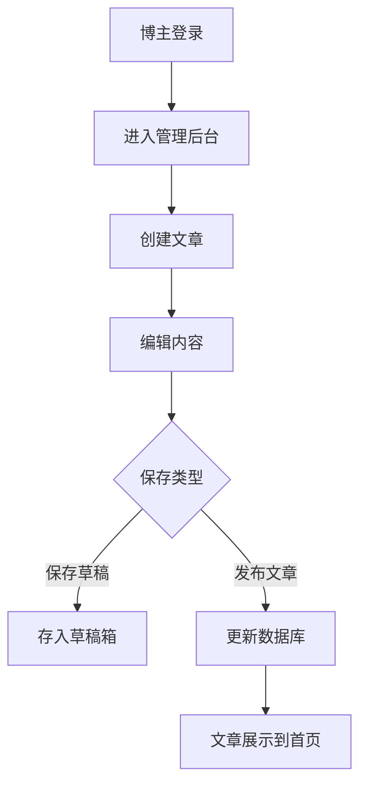
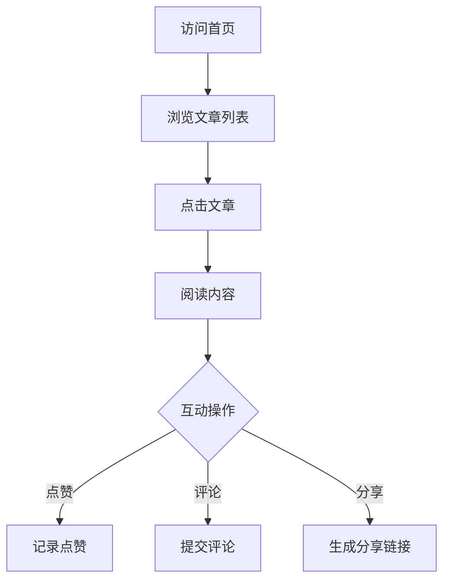
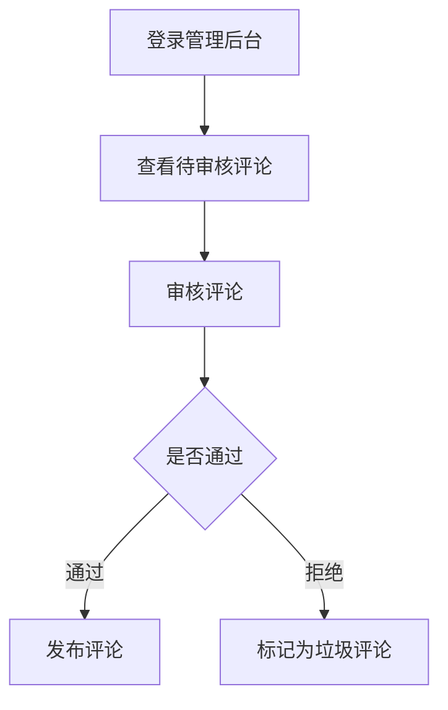
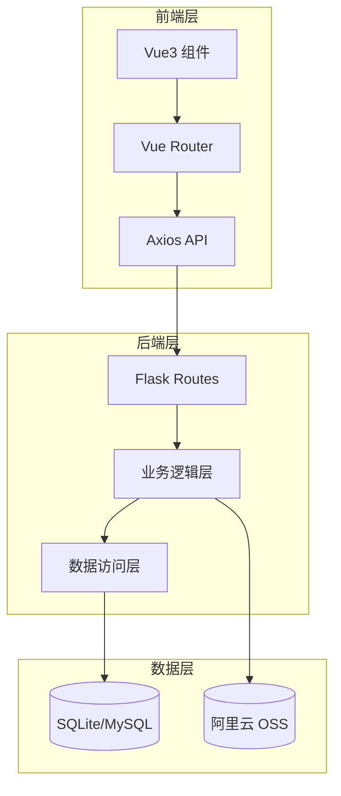
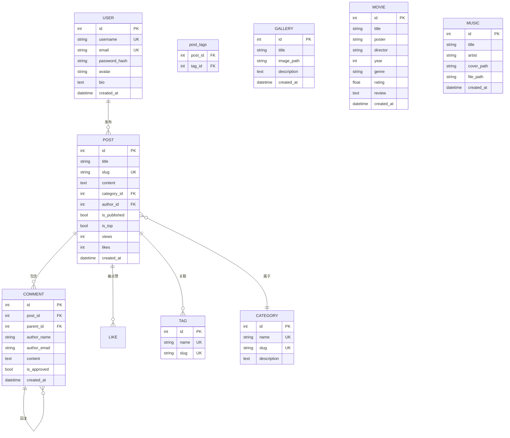

# 个人博客系统项目介绍

## 1 项目概述

### 1.1 项目背景

本项目是一个基于前后端分离架构的现代化个人博客系统，旨在为博主提供一个功能完善、界面美观的内容发布与管理平台。系统采用 Vue3 + Flask 技术栈，支持文章管理、评论互动、媒体展示等核心功能。

### 1.2 项目目标

- 为博主提供便捷的文章创作与管理工具
- 为访客提供流畅的内容浏览体验
- 支持多种媒体形式（图片、音乐、电影）的展示与管理
- 提供管理员后台进行系统配置与内容审核

### 1.3 技术栈

| 分类 | 技术 | 版本 |
|------|------|------|
| 前端框架 | Vue.js | 3.4.0+ |
| 前端构建工具 | Vite | 5.0.0+ |
| 后端框架 | Flask | 3.1.1+ |
| 数据库 | SQLite / MySQL | - |
| ORM | SQLAlchemy | 3.1.1+ |
| 认证 | JWT | 4.7.1+ |
| UI 组件 | Element Plus | - |
| 云存储 | 阿里云 OSS | - |

---

## 2 项目分析

### 2.1 业务流程分析

#### 2.1.1 内容发布流程



#### 2.1.2 用户浏览流程



#### 2.1.3 管理员审核流程



### 2.2 功能需求分析

#### 2.2.1 用户模块

| 需求编号 | 功能点 | 描述 | 优先级 |
|----------|--------|------|--------|
| U1 | 用户登录 | 支持用户名密码登录，返回 JWT token | 高 |
| U2 | 用户信息管理 | 支持修改个人资料、头像 | 中 |
| U3 | 权限控制 | 区分管理员与普通用户权限 | 高 |

#### 2.2.2 文章模块

| 需求编号 | 功能点 | 描述 | 优先级 |
|----------|--------|------|--------|
| P1 | 文章列表 | 分页展示、分类筛选、标签筛选、搜索 | 高 |
| P2 | 文章详情 | 展示文章内容、阅读量统计、点赞数 | 高 |
| P3 | 文章创建 | 支持 Markdown 编辑、分类选择、标签添加 | 高 |
| P4 | 文章编辑 | 修改已发布文章 | 高 |
| P5 | 文章删除 | 删除文章及关联评论 | 中 |
| P6 | 文章置顶 | 设置文章置顶显示 | 中 |

#### 2.2.3 评论模块

| 需求编号 | 功能点 | 描述 | 优先级 |
|----------|--------|------|--------|
| C1 | 评论展示 | 显示文章评论、支持回复 | 高 |
| C2 | 评论提交 | 匿名评论、填写昵称邮箱 | 高 |
| C3 | 评论审核 | 管理员审核评论 | 中 |
| C4 | 评论删除 | 删除不当评论 | 中 |

#### 2.2.4 媒体模块

| 需求编号 | 功能点 | 描述 | 优先级 |
|----------|--------|------|--------|
| M1 | 相册管理 | 上传、删除、展示图片 | 中 |
| M2 | 电影收藏 | 收藏电影、展示影评 | 中 |
| M3 | 音乐播放器 | 上传音乐、在线播放 | 中 |

#### 2.2.5 系统模块

| 需求编号 | 功能点 | 描述 | 优先级 |
|----------|--------|------|--------|
| S1 | 访客统计 | 记录访问量、访问时间 | 中 |
| S2 | 站点设置 | 配置站点标题、副标题等 | 中 |
| S3 | 荣誉墙 | 展示个人荣誉与成就 | 低 |
| S4 | 收藏笔记 | 收藏外部链接（如幕布笔记） | 低 |

### 2.3 非功能需求分析

| 类别 | 需求 | 描述 |
|------|------|------|
| 性能 | 响应时间 | 页面加载时间 < 2s，API 响应 < 500ms |
| 可用性 | 错误处理 | 提供清晰的错误提示信息 |
| 兼容性 | 浏览器支持 | 支持 Chrome、Firefox、Edge 主流浏览器 |
| 可扩展性 | 模块化设计 | 功能模块独立，便于后续扩展 |
| 安全性 | 数据安全 | 用户密码加密存储，防止 SQL 注入 |
| 安全性 | 权限控制 | 管理员操作需要身份验证 |

---

## 3 项目设计

### 3.1 总体设计

#### 3.1.1 架构设计

本项目采用经典的前后端分离架构：



#### 3.1.2 模块划分

| 模块 | 职责 | 文件路径 |
|------|------|----------|
| 用户模块 | 用户认证、权限管理 | `backend/routes.py`（登录/用户接口） |
| 文章模块 | 文章 CRUD、标签管理 | `backend/routes.py`（文章相关接口） |
| 评论模块 | 评论提交、审核 | `backend/routes.py`（评论相关接口） |
| 媒体模块 | 图片、音乐、电影管理 | `backend/routes.py`（gallery/music/movies接口） |
| 系统模块 | 站点设置、访客统计 | `backend/routes.py`（settings/stats接口） |

#### 3.1.3 关键设计

**JWT 认证机制**：
- 用户登录成功后返回 access_token
- 后续请求在 Authorization header 携带 token
- Flask-JWT-Extended 自动验证 token 有效性

**文件存储策略**：
- 支持本地存储和阿里云 OSS 云存储两种模式
- 通过环境变量 `USE_CLOUD_STORAGE` 切换
- 媒体文件路径存储为完整 URL

**分页机制**：
- 使用 SQLAlchemy 的 paginate 方法
- 支持自定义每页数量
- 返回总页数和总记录数

### 3.2 数据库设计

#### 3.2.1 实体关系图



#### 3.2.2 核心表结构

**user 表**（用户表）

| 字段名 | 类型 | 约束 | 说明 |
|--------|------|------|------|
| id | INTEGER | PRIMARY KEY | 用户ID |
| username | VARCHAR(80) | UNIQUE, NOT NULL | 用户名 |
| email | VARCHAR(120) | UNIQUE, NOT NULL | 邮箱 |
| password_hash | VARCHAR(128) | NOT NULL | 密码哈希 |
| avatar | VARCHAR(500) | - | 头像 URL |
| bio | TEXT | - | 个人简介 |
| site_name | VARCHAR(100) | - | 站点名称 |
| site_description | TEXT | - | 站点描述 |
| created_at | DATETIME | DEFAULT CURRENT_TIMESTAMP | 创建时间 |
| updated_at | DATETIME | ON UPDATE CURRENT_TIMESTAMP | 更新时间 |

**post 表**（文章表）

| 字段名 | 类型 | 约束 | 说明 |
|--------|------|------|------|
| id | INTEGER | PRIMARY KEY | 文章ID |
| title | VARCHAR(200) | NOT NULL | 文章标题 |
| slug | VARCHAR(200) | UNIQUE, NOT NULL | 文章别名 |
| content | TEXT | NOT NULL | 文章内容 |
| excerpt | TEXT | - | 摘要 |
| category_id | INTEGER | FOREIGN KEY | 分类ID |
| author_id | INTEGER | FOREIGN KEY | 作者ID |
| is_published | BOOLEAN | DEFAULT FALSE | 是否发布 |
| is_draft | BOOLEAN | DEFAULT TRUE | 是否草稿 |
| is_top | BOOLEAN | DEFAULT FALSE | 是否置顶 |
| views | INTEGER | DEFAULT 0 | 阅读量 |
| likes | INTEGER | DEFAULT 0 | 点赞数 |
| created_at | DATETIME | DEFAULT CURRENT_TIMESTAMP | 创建时间 |
| updated_at | DATETIME | ON UPDATE CURRENT_TIMESTAMP | 更新时间 |

**comment 表**（评论表）

| 字段名 | 类型 | 约束 | 说明 |
|--------|------|------|------|
| id | INTEGER | PRIMARY KEY | 评论ID |
| post_id | INTEGER | FOREIGN KEY | 文章ID |
| parent_id | INTEGER | FOREIGN KEY | 父评论ID |
| author_name | VARCHAR(80) | NOT NULL | 评论者姓名 |
| author_email | VARCHAR(120) | - | 评论者邮箱 |
| content | TEXT | NOT NULL | 评论内容 |
| is_approved | BOOLEAN | DEFAULT TRUE | 是否通过审核 |
| is_spam | BOOLEAN | DEFAULT FALSE | 是否垃圾评论 |
| created_at | DATETIME | DEFAULT CURRENT_TIMESTAMP | 创建时间 |

**category 表**（分类表）

| 字段名 | 类型 | 约束 | 说明 |
|--------|------|------|------|
| id | INTEGER | PRIMARY KEY | 分类ID |
| name | VARCHAR(50) | UNIQUE, NOT NULL | 分类名称 |
| slug | VARCHAR(50) | UNIQUE, NOT NULL | 分类别名 |
| description | TEXT | - | 分类描述 |
| created_at | DATETIME | DEFAULT CURRENT_TIMESTAMP | 创建时间 |

**movie 表**（电影表）

| 字段名 | 类型 | 约束 | 说明 |
|--------|------|------|------|
| id | INTEGER | PRIMARY KEY | 电影ID |
| title | VARCHAR(200) | NOT NULL | 电影标题 |
| poster | VARCHAR(500) | - | 海报 URL |
| director | VARCHAR(100) | - | 导演 |
| year | INTEGER | - | 上映年份 |
| genre | VARCHAR(100) | - | 类型 |
| rating | FLOAT | - | 评分 |
| review | TEXT | - | 影评 |
| description | TEXT | - | 剧情简介 |
| created_at | DATETIME | DEFAULT CURRENT_TIMESTAMP | 创建时间 |

**music 表**（音乐表）

| 字段名 | 类型 | 约束 | 说明 |
|--------|------|------|------|
| id | INTEGER | PRIMARY KEY | 音乐ID |
| title | VARCHAR(200) | NOT NULL | 音乐标题 |
| artist | VARCHAR(200) | - | 艺术家 |
| album | VARCHAR(200) | - | 专辑 |
| cover_path | VARCHAR(500) | - | 封面 URL |
| file_path | VARCHAR(500) | NOT NULL | 音乐文件 URL |
| genre | VARCHAR(100) | - | 类型 |
| description | TEXT | - | 描述 |
| created_at | DATETIME | DEFAULT CURRENT_TIMESTAMP | 创建时间 |

### 3.3 详细设计

#### 3.3.1 API 接口设计

**用户认证接口**

| API 路径 | HTTP 方法 | 功能描述 | 需要认证 |
|----------|-----------|----------|----------|
| `/api/login` | POST | 用户登录 | 否 |
| `/api/user` | GET | 获取当前用户信息 | 是 |
| `/api/user` | PUT | 更新用户信息 | 是 |

**文章管理接口**

| API 路径 | HTTP 方法 | 功能描述 | 需要认证 |
|----------|-----------|----------|----------|
| `/api/posts` | GET | 获取文章列表（分页） | 否 |
| `/api/posts/<slug>` | GET | 获取单篇文章 | 否 |
| `/api/posts` | POST | 创建文章 | 是 |
| `/api/posts/<int:id>` | PUT | 更新文章 | 是 |
| `/api/posts/<int:id>` | DELETE | 删除文章 | 是 |
| `/api/posts/<int:id>/like` | POST | 点赞文章 | 否 |

**评论管理接口**

| API 路径 | HTTP 方法 | 功能描述 | 需要认证 |
|----------|-----------|----------|----------|
| `/api/comments` | GET | 获取评论列表 | 否 |
| `/api/comments` | POST | 提交评论 | 否 |
| `/api/comments/<int:id>` | DELETE | 删除评论 | 是 |

**分类标签接口**

| API 路径 | HTTP 方法 | 功能描述 | 需要认证 |
|----------|-----------|----------|----------|
| `/api/categories` | GET | 获取分类列表 | 否 |
| `/api/categories` | POST | 创建分类 | 是 |
| `/api/tags` | GET | 获取标签列表 | 否 |

**媒体管理接口**

| API 路径 | HTTP 方法 | 功能描述 | 需要认证 |
|----------|-----------|----------|----------|
| `/api/gallery` | GET | 获取相册列表 | 否 |
| `/api/gallery` | POST | 上传图片 | 是 |
| `/api/gallery/<int:id>` | PUT | 更新相册 | 是 |
| `/api/gallery/<int:id>` | DELETE | 删除图片 | 是 |
| `/api/movies` | GET | 获取电影列表 | 否 |
| `/api/movies` | POST | 添加电影 | 是 |
| `/api/music` | GET | 获取音乐列表 | 否 |
| `/api/music` | POST | 上传音乐 | 是 |

**系统接口**

| API 路径 | HTTP 方法 | 功能描述 | 需要认证 |
|----------|-----------|----------|----------|
| `/api/settings` | GET | 获取站点设置 | 否 |
| `/api/settings` | POST | 保存站点设置 | 是 |
| `/api/stats` | GET | 获取统计数据 | 否 |
| `/api/visitor` | POST | 记录访客 | 否 |
| `/api/upload` | POST | 通用文件上传 | 是 |

#### 3.3.2 前端路由设计

| 路由路径 | 组件 | 功能描述 |
|----------|------|----------|
| `/` | Home.vue | 首页，展示文章列表 |
| `/login` | Login.vue | 登录页面 |
| `/about` | About.vue | 关于页面 |
| `/archive` | Archive.vue | 文章归档 |
| `/category/:name` | Category.vue | 分类文章列表 |
| `/tag/:name` | Tag.vue | 标签文章列表 |
| `/post/:slug` | PostDetail.vue | 文章详情 |
| `/gallery` | Gallery.vue | 相册页面 |
| `/honors` | Honors.vue | 荣誉墙 |
| `/hobbies` | Hobbies.vue | 兴趣爱好 |
| `/mubu` | MubuNotes.vue | 收藏笔记 |
| `/message` | MessageBoard.vue | 留言板 |
| `/admin` | Admin.vue | 管理后台首页 |
| `/admin/posts` | AdminPosts.vue | 文章管理 |
| `/admin/comments` | AdminComments.vue | 评论管理 |
| `/admin/gallery` | AdminGallery.vue | 相册管理 |
| `/admin/honors` | AdminHonors.vue | 荣誉管理 |
| `/admin/movies` | AdminMovies.vue | 电影管理 |
| `/admin/music` | AdminMusic.vue | 音乐管理 |
| `/admin/mubu` | AdminMubu.vue | 笔记管理 |
| `/admin/settings` | AdminSettings.vue | 站点设置 |

---

## 4 项目实现

### 4.1 用户认证功能实现

#### 4.1.1 登录接口

**后端实现**（`backend/routes.py`）：

```python
@app.route('/api/login', methods=['POST'])
def login():
    data = request.get_json()
    user = User.query.filter_by(username=data.get('username')).first()
    if user and user.check_password(data.get('password')):
        access_token = create_access_token(identity=str(user.id), expires_delta=timedelta(hours=24))
        return jsonify({'access_token': access_token, 'user': {'id': user.id, 'username': user.username}})
    return jsonify({'error': 'Invalid credentials'}), 401
```

**前端实现**：
- 通过 Axios 发送 POST 请求
- 成功后将 token 存储到 localStorage
- 请求拦截器自动携带 token

#### 4.1.2 用户信息管理

**后端实现**（`backend/routes.py`）：

```python
@app.route('/api/user', methods=['GET'])
@jwt_required()
def get_user():
    user_id = get_jwt_identity()
    user = User.query.get_or_404(user_id)
    return jsonify({
        'id': user.id,
        'username': user.username,
        'email': user.email,
        'bio': user.bio,
        'site_name': user.site_name,
        'avatar': user.avatar
    })
```

### 4.2 文章管理功能实现

#### 4.2.1 文章列表接口

**后端实现**（`backend/routes.py`）：

```python
@app.route('/api/posts', methods=['GET'])
def get_posts():
    page = request.args.get('page', 1, type=int)
    per_page = request.args.get('per_page', 10, type=int)
    category_id = request.args.get('category_id', type=int)
    tag_id = request.args.get('tag_id', type=int)
    search = request.args.get('search')
    
    query = Post.query.filter_by(is_published=True)
    
    if category_id:
        query = query.filter_by(category_id=category_id)
    if tag_id:
        query = query.join(Post.tags).filter(Tag.id == tag_id)
    if search:
        query = query.filter((Post.title.contains(search)) | (Post.content.contains(search)))
    
    posts = query.order_by(Post.is_top.desc(), Post.created_at.desc()).paginate(page=page, per_page=per_page)
    
    return jsonify({
        'posts': [{...}],
        'total': posts.total,
        'pages': posts.pages
    })
```

**关键技术点**：
- 使用 SQLAlchemy 的 `paginate` 方法实现分页
- 支持多条件筛选（分类、标签、搜索）
- 按置顶和创建时间排序

#### 4.2.2 文章创建接口

**后端实现**（`backend/routes.py`）：

```python
@app.route('/api/posts', methods=['POST'])
@jwt_required()
def create_post():
    data = request.get_json()
    tags = data.pop('tags', [])
    
    post = Post(
        title=data['title'],
        slug=data['slug'],
        content=data['content'],
        excerpt=data.get('excerpt', ''),
        category_id=data.get('category_id'),
        author_id=int(get_jwt_identity()),
        is_published=data.get('is_published', False),
        is_top=data.get('is_top', False)
    )
    
    for tag_name in tags:
        tag = Tag.query.filter_by(name=tag_name).first()
        if not tag:
            tag = Tag(name=tag_name, slug=tag_name.lower().replace(' ', '-'))
            db.session.add(tag)
        post.tags.append(tag)
    
    db.session.add(post)
    db.session.commit()
    return jsonify({'message': 'Post created', 'id': post.id}), 201
```

### 4.3 评论功能实现

**后端实现**（`backend/routes.py`）：

```python
@app.route('/api/comments', methods=['POST'])
def create_comment():
    data = request.get_json()
    comment = Comment(
        post_id=data['post_id'],
        parent_id=data.get('parent_id'),
        author_name=data['author_name'],
        author_email=data.get('author_email'),
        content=data['content'],
        is_approved=True
    )
    db.session.add(comment)
    db.session.commit()
    return jsonify({'message': 'Comment added', 'id': comment.id}), 201
```

### 4.4 文件上传功能实现

**后端实现**（`backend/routes.py`）：

```python
@app.route('/api/upload', methods=['POST'])
@jwt_required()
def upload_file():
    if 'file' not in request.files:
        return jsonify({'error': 'No file part'}), 400
    
    file = request.files['file']
    if file and '.' in file.filename and file.filename.rsplit('.', 1)[1].lower() in app.config['ALLOWED_EXTENSIONS']:
        try:
            if Config.USE_CLOUD_STORAGE:
                file_url = get_oss_storage().upload_file(file.stream, file.filename, 'uploads')
                return jsonify({'filename': file.filename, 'url': file_url}), 201
            else:
                filename = str(datetime.now().timestamp()).replace('.', '') + '_' + file.filename
                filepath = os.path.join(app.config['UPLOAD_FOLDER'], filename)
                file.save(filepath)
                return jsonify({'filename': filename, 'url': f'/uploads/{filename}'}), 201
        except Exception as e:
            return jsonify({'error': f'Upload failed: {str(e)}'}), 500
    return jsonify({'error': 'Invalid file type'}), 400
```

**关键技术点**：
- 支持阿里云 OSS 云存储
- 自动生成唯一文件名
- 文件类型白名单校验

### 4.5 数据统计功能实现

**后端实现**（`backend/routes.py`）：

```python
@app.route('/api/stats', methods=['GET'])
def get_stats():
    post_count = Post.query.filter_by(is_published=True).count()
    comment_count = Comment.query.filter_by(is_approved=True).count()
    like_count = Like.query.count()
    visitor_count = Visitor.query.count()
    
    return jsonify({
        'posts': post_count,
        'comments': comment_count,
        'likes': like_count,
        'visitors': visitor_count
    })
```

---

## 5 项目测试与评价

### 5.1 功能测试

#### 5.1.1 测试用例

**用户登录测试**

| 测试场景 | 输入 | 预期结果 |
|----------|------|----------|
| 正确用户名密码 | username=admin, password=admin123 | 返回 token 和用户信息 |
| 错误密码 | username=admin, password=wrong | 返回 401 错误 |
| 不存在用户 | username=nonexist, password=123 | 返回 401 错误 |

**文章列表测试**

| 测试场景 | 输入 | 预期结果 |
|----------|------|----------|
| 获取第一页 | page=1, per_page=10 | 返回最多 10 篇文章 |
| 分类筛选 | category_id=1 | 返回该分类下的文章 |
| 搜索 | search=关键词 | 返回包含关键词的文章 |

**文件上传测试**

| 测试场景 | 输入 | 预期结果 |
|----------|------|----------|
| 上传有效图片 | PNG 格式图片 | 返回文件 URL |
| 上传无效文件 | EXE 可执行文件 | 返回 400 错误 |
| 未登录上传 | 无 token | 返回 401 错误 |

#### 5.1.2 API 接口测试

通过 curl 命令验证接口：

```bash
# 登录
curl -X POST http://localhost:5000/api/login \
  -H "Content-Type: application/json" \
  -d '{"username":"admin","password":"admin123"}'

# 获取文章列表
curl http://localhost:5000/api/posts?page=1&per_page=5

# 获取统计数据
curl http://localhost:5000/api/stats
```

### 5.2 项目评价

#### 5.2.1 优点

1. **技术选型合理**：采用 Vue3 + Flask 前后端分离架构，代码结构清晰
2. **功能完善**：涵盖文章管理、评论系统、媒体管理等核心博客功能
3. **安全性**：JWT 认证、密码加密、SQLAlchemy ORM 防注入
4. **扩展性强**：模块化设计，便于后续功能扩展
5. **配置灵活**：支持 SQLite/MySQL 切换，支持本地/OSS 存储切换

#### 5.2.2 待改进项

1. **缺少单元测试**：需要添加 API 接口测试用例
2. **图片压缩**：上传图片时应自动压缩，减少存储空间占用
3. **缓存机制**：热门文章可添加 Redis 缓存，提升访问速度
4. **邮件通知**：评论回复时可添加邮件通知功能
5. **SEO 优化**：添加 meta 标签优化搜索引擎收录

---

## 6 总结与展望

### 6.1 总结

本项目成功实现了一个功能完整的个人博客系统，主要完成内容包括：

1. **用户认证模块**：实现了基于 JWT 的用户登录与权限控制
2. **文章管理模块**：支持文章的创建、编辑、发布、删除和搜索
3. **评论系统**：支持匿名评论、评论回复和管理员审核
4. **媒体管理模块**：支持图片相册、电影收藏、音乐播放功能
5. **系统管理模块**：提供站点设置、数据统计、访客记录等功能
6. **云存储集成**：支持阿里云 OSS 存储，便于部署和扩展

### 6.2 展望

未来可继续扩展的功能方向：

1. **社交功能**：添加用户关注、文章分享到社交媒体
2. **富文本编辑器**：集成更强大的 Markdown 编辑器或富文本编辑器
3. **数据可视化**：使用图表展示博客数据统计
4. **移动端适配**：优化移动端浏览体验
5. **多用户支持**：支持多博主共同管理
6. **RSS 订阅**：提供文章 RSS 订阅功能
7. **全文搜索**：集成全文搜索引擎提升搜索体验

---

## 附录

### A 项目文件结构

```
MyBlog/
├── backend/                    # 后端 Flask 应用
│   ├── app.py                 # 应用入口
│   ├── config.py              # 配置文件
│   ├── routes.py              # API 路由
│   ├── models.py              # 数据库模型
│   ├── oss_utils.py           # OSS 工具类
│   ├── init_db.py             # 数据库初始化
│   ├── requirements.txt       # 依赖列表
│   ├── .env                   # 环境变量
│   └── migrations/            # 数据库迁移
├── frontend/                   # 前端 Vue 应用
│   ├── src/
│   │   ├── components/        # 公共组件
│   │   ├── views/             # 页面视图
│   │   │   └── admin/         # 管理员页面
│   │   ├── router/            # 路由配置
│   │   ├── styles/            # 样式文件
│   │   ├── App.vue            # 根组件
│   │   └── main.js            # 入口文件
│   ├── public/                # 静态资源
│   ├── vite.config.js         # Vite 配置
│   └── package.json           # 依赖列表
├── deploy/                    # 部署相关
│   ├── DEPLOY_GUIDE.md        # 部署指南
│   ├── deploy.sh              # 部署脚本
│   └── myblog_nginx.conf      # Nginx 配置
└── README.md                  # 项目说明
```

### B 运行说明

#### B.1 环境要求

- Python 3.9+
- Node.js 18+
- SQLite（开发环境）或 MySQL 8.0+（生产环境）

#### B.2 启动步骤

**后端启动**：
```bash
cd backend
pip install -r requirements.txt
python app.py
```

**前端启动**：
```bash
cd frontend
npm install
npm run dev
```

#### B.3 默认账号

| 用户名 | 密码 | 角色 |
|--------|------|------|
| admin | admin123 | 管理员 |

#### B.4 API 访问地址

- 后端 API：`http://localhost:5000/api`
- 前端页面：`http://localhost:5173`

---

**项目版本**：v1.0.0  
**创建时间**：2026年  
**作者**：个人开发者